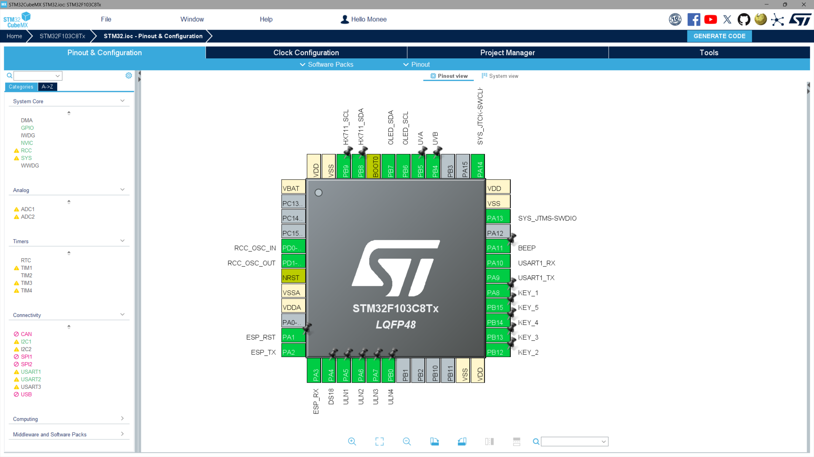
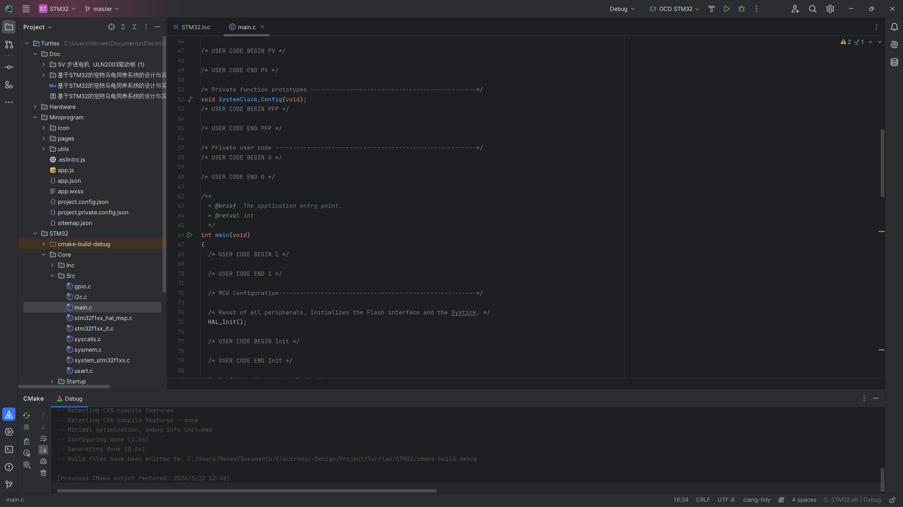
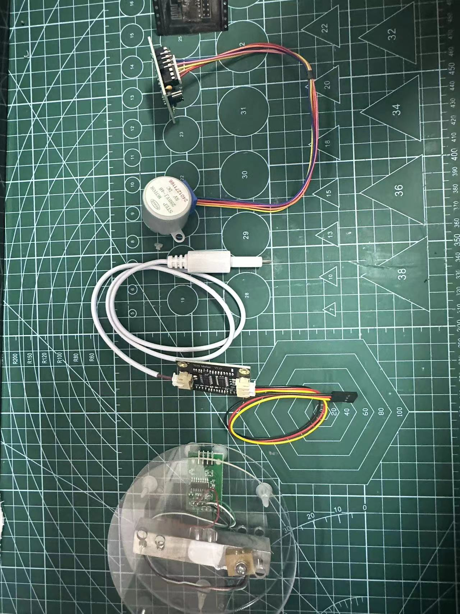

基于STM32的宠物乌龟饲养系统的设计与实现   

【开发环境】

IDE：CLion + STM32CubeMX

EDA：嘉立创

 【硬件】
单片机:STM32F103C8T6      
网络：WIFI模块 ESP8266-01S
传感器：水温DS18B20模块 ，压力HX117模块，TDS水质检测模块、光照UVA、UVB
控制：蜂鸣器报警 、ULN2003驱动板+步进电机（投喂）
显示：OLED屏幕显示数据
远程传输协议：MQTT协议（网络） ，使用MQTT服务器，远程传输数据到小程

小程序采用微信开发者工具开发  包含下面功能：  
1、登录\ 主页
2、远程控制进行喂食、换水、模拟日光
3、查看水温、水质、光照
4、数据异常，有特别显示 并调整硬件
5、查看近期历史数据    

（1）自动化投喂系统：通过定时器设置步进电机旋转投喂器，用较低的成本实现自动喂食，确保乌龟的健康成长

（2）防越狱系统：当HX711压力传感器模块数据发生突变时，乌龟越狱系统报警，提醒主人赶快回家找乌龟

（3）恒温加热系统：在乌龟缸中水温低于额定温度（16度）时，自动报警并告知主人，并且自动开启加热棒缓慢进行加热

（4）照明系统：远程智能化灯光控制，根据智能乌龟缸中水温和乌龟状态自动开启模拟日光灯对乌龟进行晒背，为乌龟提供适宜的光照环境，进而提高乌龟温度方便活动。在水温温度较低时自动开启UVA灯，可加热照明并促进乌龟食欲；在乌龟长时间未受到阳光照射时通过微信小程序打开UVB灯，UVB紫外线可以促进维生素D的形成

（5）自动化过滤水系统：根据测得的水质参数，只需在乌龟缸水质不达标的情况下通过水泵、过滤器等设备，自动实现乌龟缸内水质的循环过滤，保持水质达标，为乌龟提供更舒适的栖息环境

